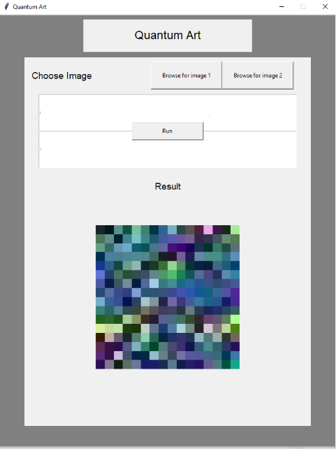

# qiskitsummerjam
### Entry for 2020 Qiskit Summer Jam - NC

### Alex Xu, Achilles Dabrowski, Franklin Boampong, Sam Lamba

Quantum Art is a program that uses Quantum Computing to generate pixel art. By using pixel data from input images, superposition on quantum registers, and a pixel color decoding process, we are able to generate new pixel art. Quantum Art provides a fun interactive method to learn and experiment with the quantum world, and a graphical user interface is developed for easy interaction.

### Instructions:

Make sure to install all required dependencies into your Anaconda Environment:
- Pillow
- Tk
- matplotlib
- Qiskit (Requires IBM Quantum Experience setup. Can be done by inputting API key and running setup.py that is included).

Next, run '''gui.py'''
